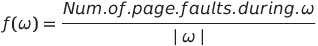

## Lecture10. Virtual memory management

### 가상 메모리 관리

---

### 🌞 recap

- 가상 메모리 (기억장치)  
  → Non-continuous allocation  
   : 사용자 프로그램을 block으로 분할하여 적재, 실행  
  → Paging/Segmentation system
- 가상 메모리 관리의 목적
  - 👑**가상 메모리 시스템 성능 최적화**  
    : *지표*가 필요  
    → Cost model  
    → 다양한 최적화 기법

### 🌞 Cost Model from Virtual Mem. Sys.

- **Page fault frequency (발생 빈도)**  
  → page fault : page system 하에서 CPU가 memory를 참조하려고 하는데 memory에 맞는 page가 없는 경우
- **Page fault rate (발생률)**

> ❗❗❗ **Page fault rate를 최소화 할 수 있도록 전략들을 설계해야 함**  
>  → Context switch 및 Kernel 개입을 최소화  
>  → 시스템 성능 향상

- 용어 정리

  - Page reference string (d)  
    → 프로세스의 수행 중 참조한 페이지 번호 순서  
    → ω = r₁r₂···rk···rt
    - ri = 페이지 번호, ri ∈ { 0, 1, 2, ··· , N-1 }
    - N : 프로세스의 페이지 수 (0 ~ N-1)
      → 왜 Page reference string을 저장할까?  
       : 어떤 페이지들을 읽어왔는지 정보가 있어야 *효율적 사용 여부*를 알 수 있음
  - Page fault rate = F(ω)  
      
    → |ω| 는 개수!  
    → 전체 page 개수 중에 fault가 몇 번 났는가? 라는 의미

### 🌞 (가상메모리 관리를 위한) Hardware Components

- Address translation device (주소 사상 장치)  
  : 주소 사상을 효율적으로 수행하기 위해 사용  
   → E.g., TLB(associated memories), Dedicated page-table register
- **Bit Vectors**  
  : *Page 사용 상황에 대한 정보를 기록*하는 비트들  
   → Reference bits (used bit) : 참조 비트  
   → Update bits (modified bits, write bits, 👑**dirty bits**\_많이 사용) : 갱신 비트

#### 🔑**Bit Vectors**

: reference bit vector와 update bit vector는 PMT(Page Map Table) 안에 위치

- Reference bit vector
  - 메모리에 적재된 각각의 page가 **최근에 참조되었는지**를 표시 => Locality(지역성)
  - 운영  
    ① 프로세스에 의해 참조되면 해당 page의 Ref.bit를 1로 설정  
    ② 주기적으로 모든 reference bit를 0으로 **초기화**
  - Reference bit를 확인함으로서 최근에 참조된 page들을 확인 가능
- Update bit vector
  - Page가 메모리에 적재된 후, 프로세스에 의해 수정 되었는지를 표시  
    : 왜 저장하는가?
    - 물리적 메모리에 올라간 데이터가 업데이트 되면 swap device에 있는 데이터와 값이 달라짐. 달라진 값은 작업이 끝난 후 반영해줘야 한다(**Write back**).
  - 주기적 초기화 없음
  - Update bit = 1  
    → 해당 page의 (Main memory 상 내용) ≠ (Swap device의 내용)  
    → 해당 page에 대한 Write-back (to swap device)이 필요

### 🌞(가상 메모리 관리를 위한) Software Components

> - 기법들
>   - Allocation strategies (할당 기법)
>   - Fetch strategies
>   - Placement strategies (배치 기법)
>   - Replacement strategies (교체 기법)
>   - Cleaning strategies (정리 기법)
>   - Load control strategies (부하 조절 기법)

1. Allocation Strategies

   - **각 프로세스에게 메모리를 얼마만큼 줄 것인가?**
     - Fixed allocation (고정 할당) : 프로세스 실행 동안 고정된 크기의 메모리 할당
     - Variable allocation (가변 할당) : 프로세스 실행 동안 할당하는 메모리 크기가 유동적
   - 고려사항
     - 프로세스 실행에 필요한 메모리 양을 예측해야 함
     - 너무 큰 메모리 할당 (Too much allocation) ⇒ 낭비
     - 너무 적은 메모리 할당 (Too small allocation)  
       ⇒ Page fault rate가 커짐  
       ⇒ 시스템 성능 저하

2. Fetch Strategies  
   (fetch : swap device에서 메모리로 가져오는 것)

   - **특정 page를 메모리에 언제 적재할 것인가?**
     - Demand fetch (demand paging)  
       → 프로세스가 참조하는 페이지들만 적재  
       → Page fault overhead
     - Anticipatory fetch (pre-paging)  
       (: 만화방에서 만화를 여러권 미리 갖다놓는 것 같은 그런 행위...?)  
       → 참조될 가능이 높은 page 예측  
       → 가까운 미래에 참조될 가능성이 높은 page를 미리 적재  
       → 예측 성공 시, page fault overhead가 없음  
       → Prediction overhead (Kernel의 개입), Hit ratio에 민감함
   - **실제 대부분의 시스템은 Demand fetch 기법 사용**  
     → 일반적으로 준수한 성능 보여 줌✨  
     → Anticipatory fetch  
      : Prediction overhead, 잘못된 예측 시 자원 낭비가 큼

3. Placement Strategies

   - **Page/segment를 어디에 적재할 것인가?**
   - Paging system에는 불필요
   - Segmenttation system에서의 배치 기법  
     : First-fit / Best-fit / Worst-fit / Next-fit

4. Replacement Strategies

   - **빈 프레임이 없는 경우 새로운 page를 어떤 page와 교체 할 것인가?**
   - Fixed allocation을 위한 교체 기법 / Variable allocation을 위한 교체 기법  
     (이후 자세하게 강의하는 시간 있음)

5. Cleaning Strategies

   - **변경 된 page를 언제 write-back 할 것인가?**  
     (update bit(dirty bit)의 값이 1인 경우를 반영 후 cleaning)
     - Demand cleaning : 해당 page에 메모리에서 내려올 때 write-back
     - Anticipatory cleaning (pre-cleaning)  
       → 더 이상 변경될 가능성이 없다고 판단할 때 미리 write-back  
       → Page 교체 시 발생하는 write-back 시간 절약  
       → Write-back 이후, page 내용이 수정되면 overhead 증가
   - 실제 대부분의 시스템은 Demand cleaning 기법 사용

6. Load Control Strategies (일반적으로 load는 부하)
   - **시스템의 multi-programming degree 조절**  
     → Allocation strategies와 연계 됨
   - 적정 수준의 multi-programming degree 유지 필요
     - 적정수준 : 고원 상태(plateau)
     - 저부하 상태(Under-loaded)  
       : 시스템 자원 낭비, 성능 저하
     - 고부하 상태(Over-loaded)  
       : 자원에 대한 경쟁 심화, 성능 저하  
       : ⭐**Thrashing(스레싱)** 현상 발생 ⇒ 과도한 page fault가 발생하는 형상

### 🌞(Software Components 중 ) Replacement strategies (교체 기법)

- 기준 - **Locality**⭐  
  → 프로세스가 프로그램/데이터의 특정 영역을 집중적으로 참조하는 현상
  → 원인
  - Loop structure in program
  - Array structure 등의 데이터 구조  
    → 공간적 지역성(Spatial locality) : 참조한 영역과 인접한 영역을 참조하는 특성  
    → 시간적 지역성(Temporal locality) : 한 번 참조한 영역을 곧 다시 참조하는 특성

> 1. Fixed Allocation
> 2. Variable Allocation

### 🔑 Fixed Allocation

(정해진 수의 영역을 할당했을 때의 교체 방법)

1. Min Algorithm (OPT algorithm)

   - 1966년 Belady에 의해 제시
   - **Minimize page fault frequency** (proved)⇒ Optimal solution✨
   - ⭐기법 : 앞으로 _가장 오랫동안 참조되지 않을 page_ 교체  
     → Tie-breaking rule : page 번호가 가장 큰 /작은 페이지 교체
   - 실행 불가능한 기법 (Unrealizable)  
     → Page reference string을 미리 다 알고 있어야 함
   - *교체 기법의 성능 평가 도구*로 사용 됨

2. Random Algorithm

   - 무작위로 교체할 page 선택
   - Low overhead
   - No policy
   - 평가 기준 ex. X라는 알고리즘을 만들었는데 random보다도 성능이 안 좋다 등

3. FIFO Algorithm
   - 선입선출 - 가장 오래된 page 교체
   - **page가 적재 된 시간**을 기억하고 있어야 함
   - 자주 사용되는 page가 교체 될 가능성이 높음  
     → Locality에 대한 고려가 없음
   - FIFO anomaly (belady's anomaly)  
     → FIFO 알고리즘의 경우, 더 많은 page frame을 할당 받지만 page fault의 수가 증가하는 경우

**※Locality를 활용하는 알고리즘 시작**

4. LRU (Least Recently Used) Algorithm

   - 가장 오랫동안 참조되지 않은 page를 교체
   - page 참조 시 마다 시간을 기록해야 함
   - MIN algorithm에 근접한 성능을 보여줌
   - 실제로 가장 많이 활용함!
   - 👹단점
     - 참조 시마다 시간 기록 필요 (Overhead) → 간소화된 정보 수집으로 해소 가능
     - Loop 실행에 필요한 크기보다 작은 수의 page frame이 할당 된 경우, page fault 수가 급격히 증가함  
       → Allocation 기법에서 해결이 필요!

5. LFU (Least Frequently Used) Algorithm

   - 가장 참조 횟수가 적은 page를 교체
   - page 참조 시 마다, *참조 횟수*를 누적 시켜야 함
   - Locality 활용
   - 👹단점
     - 최근 척제된 참조될 가능성이 높인 page가 교체될 가능성이 있음
     - 참조 횟수 누적 overhead

6. NUR (Not Used Recently) Algorithm

   - LRU approximation scheme  
     : LUR보다 적은 overhead로 비슷한 성능 달성 목적
   - Bit vector 사용  
     → Reference bit vector (r), Update bit vector (m)
   - 교체 순서
     - ① (r, m) = (0, 0)
     - ② (r, m) = (0, 1)
     - ③ (r, m) = (1, 0)
     - ④ (r, m) = (1, 1)

7. Clock Algorithm : 실제로 NUR을 적용한 예

   - IBM VM/370 OS
   - Reference bit 사용함 : 주기적인 초기화 없음
   - 0이면 교체, 1이면 초기화 후 pointer 이동
   - 먼저 적재된 page가 교체될 가능성이 높음 - FIFO와 유사
   - Reference bit를 사용하여 교체 페이지 결정 - LRU, NUR과 유사

8. Second Change Algorithm
   - Clock algorithm과 유사
   - Update bit (m)도 함께 고려 함
     - 현재 가리키고 있는 page의 (r, m) 확인
